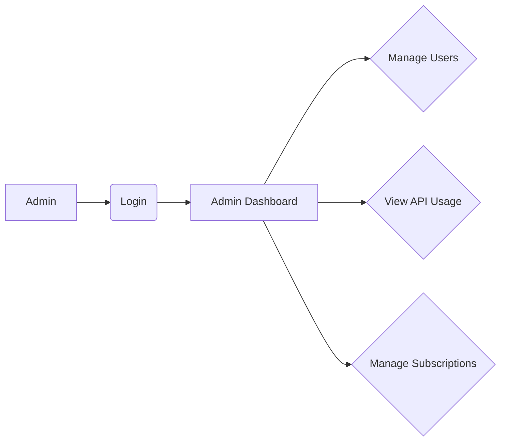

## GoldPriceNow System Flow Documentation

### 1. User Workflows

**1.1 Free User Registration and Gold Price Access:**

```mermaid
graph LR
A[User] --> B(Registration);
B --> C{Email Verification?};
C -- Yes --> D(Verify Email);
C -- No --> E;
D --> E;
E --> F(Login);
F --> G[Dashboard];
G --> H(Access /api/v1/goldprice (limited requests));
```

**1.2 Premium User Workflow:**

```mermaid
graph LR
A[User] --> B(Registration);
B --> C{Email Verification?};
C -- Yes --> D(Verify Email);
C -- No --> E;
D --> E;
E --> F(Login);
F --> I(Upgrade to Premium);
I --> J(Payment via Stripe);
J --> K(Subscription Activated);
K --> G[Dashboard];
G --> H(Access /api/v1/goldprice (unlimited requests));
```

**1.3 Admin User Workflow:**




### 2. Data Flows

```mermaid
graph LR
A[Yahoo Finance API/Kitco.com] --> B(Gold Price Fetcher);
B --> C[PostgreSQL (gold_prices)];
C --> D(API Endpoint /api/v1/goldprice);
D --> E[User];
F[User Registration/Login] --> G[PostgreSQL (users)];
G --> D;
H[Stripe] --> I[PostgreSQL (subscriptions)];
I --> G;
D --> J[PostgreSQL (api_usage)];
J --> C;
K[Admin Dashboard] --> G;
K --> C;
K --> J;
K --> I;

```

### 3. Integration Points

```mermaid
graph LR
A[Frontend (React)] --> B(Backend API);
B -- /register --> C[User Registration];
B -- /login --> D[User Authentication];
B -- /forgot-password --> E[Password Reset];
B -- /dashboard --> F[Dashboard Data];
B -- /api/v1/goldprice --> G[Gold Price API];
G --> H[Gold Price Fetcher Service];
H --> I[PostgreSQL];
J[Stripe API] --> B;
K[Admin Panel] --> B;
B --> L[Email Service (optional)];

```

### 4. Error Handling

* **Gold Price Fetching:**  If Yahoo Finance API fails, fallback to Kitco scraping.  If both fail, log the error and use the last successfully fetched price. Implement retry mechanisms with exponential backoff.
* **API Key Authentication:**  Invalid API keys return HTTP 401 (Unauthorized). Rate limit exceeded returns HTTP 429 (Too Many Requests).
* **Database Errors:**  Log database errors and implement retry logic for critical operations.
* **Payment Processing:** Handle Stripe errors gracefully and inform the user.
* **General Errors:**  Use comprehensive logging to track errors and implement centralized error monitoring.  Return appropriate HTTP status codes to the client.


**Note:** This documentation provides a high-level overview.  Detailed error handling and specific implementation details would be documented further in individual component specifications.
